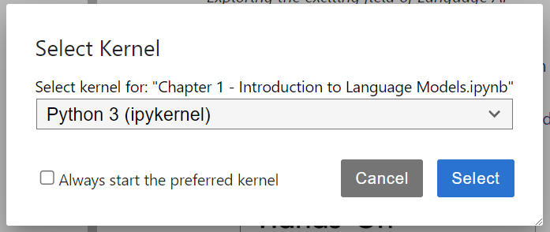

<!-- TODO: Finish up specific instructions with https://medium.com/@mohammdowais/how-to-record-terminal-in-a-windows-computer-c140feb9a6e3 -->

# Local Environment with Conda

Our preferred method for running the code locally is through a version-controlled environment with Conda. 

## 1. Installing Miniconda

To setup a conda environment that contains both Python and all the necessary dependencies, we advise you to use a minimal version of conda, aptly named [miniconda](https://docs.anaconda.com/free/miniconda/miniconda-other-installer-links/). 

Here, based on your operating system, we choose an installer that has python 3.10 pre-installed. To illustrate, we would install the following on Windows:


and the following on Linux:


## 2. Setting up a Conda Environment

After installation, you will need to open up your terminal and create your environment as follows:

```bash
conda create -n thellmbook python=3.10
```

We will need to activate the environment first before we can use it:

```bash
conda activate thellmbook
```

## 2. Installing Dependencies

After creating our environment, we will need to install all the dependencies. If you created your environment using the `environment.yml` file, you can skip over this. 

There are two methods that you can follow to install the dependencies:
1. Install all dependencies with `requirements.txt` which requires Microsoft Visual C++ 14.0
2. Install base depedencies with `requirements_base.txt` which requires specific installations in certain chapters

The first method, is to directly install **all** dependencies (aside from Chapter 11) using the `requirements.txt` by running the following from the root of this repository:

```bash
pip install -r requirements.txt
```

This should install all necessary dependencies in the environment we just created. 

> [!TIP]
> The `requirements.txt` file pins versions of dependencies for reproducibility. However, this might mean you are missing out
> on new features of many of the packages. You can also use `requirements_min.txt` instead that will install all the latest versions.
> Do note that this might break certain examples as the API of these packages can change over time.

> [!WARNING]
> If you get the following error `error: Microsoft Visual C++ 14.0 or greater is required.` then you will need to install C++. 
> Follow the instructions [here](common_issues.md) for an installation guide before you can install your environment.

### [OPTIONAL] Installing dependencies with conda
If you run into issues with the `requirements.txt` file, you can also install a base set of dependencies that are installed throughout the book:

```bash
pip install -r requirements_base.txt
```

The missing dependencies can be installed by following the instructions in the README in each chapter's folder.
Or you can install them all at once:

```bash
# Install BERTopic and annoy through conda to prevent additional C++ installations
# conda config --add channels conda-forge
conda config --append channels conda-forge
conda install bertopic=0.16.0 python-annoy=1.17.2
```

This allows you to have more flexibility over supported packages and some that might go out of support at some point.

## 3. Installing PyTorch

Now that we have installed all necessary dependencies, you might want to update one specific dependency, namely PyTorch. Depending on your system, PyTorch might install a CPU-based version and for most of the example, we will need to make use of the GPU.

If you go to the official [PyTorch website](https://pytorch.org/), then you'll find on the frontpage the current guideline for installing the package:


There, you can choose which CUDA version you need (it is typically advised to choose the default). Copy the lines for pip installation and run them in your terminal:


```bash
pip3 install --upgrade torch torchvision torchaudio --index-url https://download.pytorch.org/whl/cu118
```

Note that wes added the `--upgrade` tag here to make sure the CPU-version of PyTorch is overwritten with the GPU-version.

## 4. Starting Jupyter Lab

After having installed all necessary packages, you can then use Jupyter Lab (or any other notebook backend) to run all of the notebooks associated with each chapter. You can start Jupyter Lab directly from the terminal:

```bash
jupyter lab
```

When you start running each notebook, make sure to check whether you have selected the correct environment. You can do so by selecting the "ipykernel" on the top right:


You will then see a screen that allows you to select the "thellmbook" environment from the list:




To validate whether this worked, you can check if the selected environment has access to a GPU:


```python
import torch

torch.cuda.is_available()
```

or by checking the name of the current conda environment:

```python
import sys
import os

# Get the path to the current conda environment
python_path = sys.executable
env_path = os.path.dirname(os.path.dirname(python_path))
env_name = os.environ.get('CONDA_DEFAULT_ENV')
env_name
```
